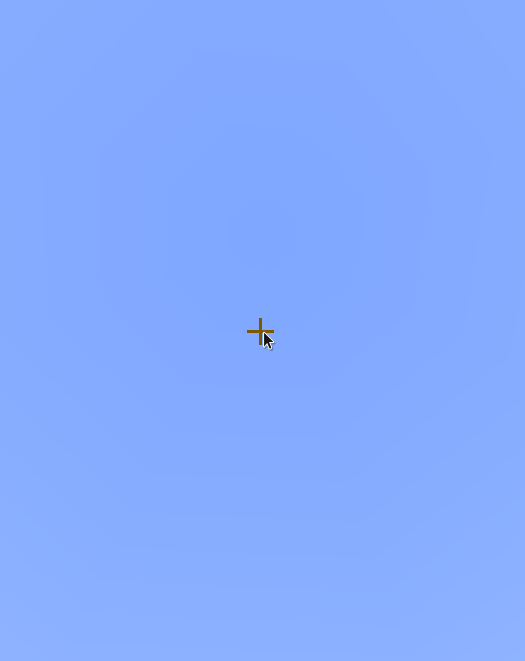

Now it's time to go over every composable elements.

## Special Composable Methods
Before we look at different composable elements, here are some useful methods in them:

### Composable#bind

*Binds* a reactive state to this component, so whenever the state changes its value, the composable
is marked dirty and will be re-rendered next tick.

### Composable#into

Sets reactive state value to this component. Similar to React `ref` prop.

```java
ReactiveState<Selection> myState = useState(null);
Selection mySelection = // ...
mySelection.into(myState);
assert myState.getOrNull() != null;
```

### Composable#configure

Allows to configure a composable, e.g. subscribing handlers to certain states.

## FunctionComposable

Normally, it is not recommended to extend the raw `Composable` interface
if you want to implement your own composable logic. Instead, you should extend the 
`FunctionComposable` abstract class.

Here's an example:

```java
public class DocFC extends FunctionComposable<DocFC.Props> {

    public DocFC(Props props) {
        super(props);
    }

    @Override
    public @NotNull Composable compose() {
        return Placeholder.of(Items
                .builder(Material.GOLD_INGOT)
                .name(props.name)
                .lore(props.lore)
        );
    }

    public record Props(String name, String lore) { }
}
```

!!! info
    You can also override the `click`, `rightClick`, etc. methods to handle click logic, just like Frames.
    
    Additionally, you can override `destroy` (for logic that is called when frame with composable is closed)
    and `restore` (for logic that is called when frame with composable is *restored*, e.g. when pagination happens)

The result:


## Placeholder

A placeholder is a non-interactable slot. Not much about it.

```java
Placeholder.of(Items.empty()); // thats it really
```

## Button

Button is a clickable element. You can create button with a builder or normally.

```java
// No builder
Button.of(
    ItemProvider.still(Items.withName(Material.DIAMOND, "Button!")),
    (btn, e) -> true // (1)!
);
// Builder (recommended, more configuration)
        Button
                .builder(ItemProvider.still(Items.withName(Material.DIAMOND, "Button!")))
                .onClickCancelling((btn, e) -> { /* (2)! */ })
                .onLeftClick((btn, e) -> true)
                .disabled(false)
                .inside(Slot.ROW_ONE_SLOT_ONE);

```

1. Return true to cancel event, return false for event to continue
2. Methods that end with `cancelling` will automatically cancel events, so you don't have to return a boolean

## Checkbox

Checkbox is a button that can be toggled on and off.
Can be built with builder or without

```java
Checkbox
    .builder()
    .isChecked(true)
    .checkedItem(null /* (1)! */)
    .inside(Slot.ROW_TWO_SLOT_FIVE);
```

1. Optional, if null, default value will be used

Result:


You can also optionally set name and description of a checkbox

## Selection

A selection provides a choice between multiple values. You can scroll through a selection using
both right (backward) and left (forward) click.

```java
Selection
    .builder(
        List.of("Value 1", "Value 2", "Value 3", "Value 4")
    )
    .selected(3) // (1)!
    .formatter(str -> str) // (2)!
    .inside(Slot.ROW_TWO_SLOT_FIVE);
```

1. Sets current selected index to 3
2. Adds a formatter for values. Useful if you have an Enum inside the selection. **NOTE**: either an explicit ItemProvider should be set through `item`, or a formatter through `formatter`, otherwise the composable will not work.

Result:


## Slideshow

Slideshow is a periodically changing Placeholder.

```java
Slideshow
    .of(List.of(
        Items.builder(Material.GOLD_INGOT),
        Items.builder(Material.DIAMOND),
        Items.builder(Material.EMERALD),
        Items.builder(Material.IRON_INGOT)
    ), 10 /* (1)! */)
    .inside(Slot.ROW_TWO_SLOT_FIVE);
```

1. Period of item changing, in ticks. 10 ticks is equal to half a second.

Result:


## GoBackButton

A GoBackButton returns you to previously visited frame. It will only render if there was a previous frame.

```java
GoBackButton.create().inside(Slot.ROW_ONE_SLOT_ONE);
```

Result:



## TextInput

A TextInput allows user to input text, and may additionally validate it.

```java
TextInput
    .builder()
    .validate(Validator.matching("[a-z_\\d]*"))
    .build()
    .configure(input -> input.onTextChange(newText -> getViewer().sendRichMessage(newText)))
    .inside(Slot.ROW_TWO_SLOT_FIVE);
```

Result:


You can also use some commonly used builtin validators via the `Validators` utility class.

## ProgressBar

A progress bar allows you to display certain progress, based on a ReactiveState.

```java
var state = useState(0f);
FlareUtil.executeNTimesAsync(() -> state.set(state.get() + .05f), 20, 10);
this.compose(
    ProgressBar.of(
        ProgressBar.fullProvider(state, Material.GREEN_STAINED_GLASS_PANE, false), 
        ProgressBar.emptyProvider(state, Material.YELLOW_STAINED_GLASS_PANE, true)
        /* (1)! */
    )
    .configure(bar -> bar.progressState().connect(state)) // (2)!
    .bind(state)
    .inside(Slot.ROW_TWO)
);
```

1. The last boolean is the `dotted` parameter. It changes the way progress is displayed inside item lore.
2. Makes it so that whenever `state` changes, new value is propagated to bar's progress state

!!! warning
    It is important that the progress state should be within 0 and 1. Otherwise, errors may arise.

Result:


## ContainerSlot

A container slot is a slot that can store and accept items inside it.

```java
ContainerSlot
    .builder()
    .filterPut((item, e) -> item.getType() == Material.DIAMOND)
    .onPut((item, e) -> e.getWhoClicked().sendPlainMessage("Put diamond!"))
    .onTake((item, e) -> e.getWhoClicked().sendPlainMessage("Took diamond!"))
    .inside(Slot.ROW_TWO_SLOT_FIVE);
```

Result:


## Composition

A composition by itself does not render anything, it can contain different composable elements in
itself. All elements are assigned with relative slot space. For example, if you create a composition
like this:

```java
Button button = ...;
Placeholder placeholder = ...;
Composition.of(
    button.inside(Slot.ROW_ONE_SLOT_ONE),
    placeholder.inside(Slot.ROW_TWO_SLOT_TWO)
);
```

When it is then rendered inside `Rect from Slot.ROW_TWO_SLOT_THREE to Slot.ROW_THREE_SLOT_FOUR`, it will be displayed
this way:

``` title="# - empty, p - placeholder, b - button"
#########
##b######
###p#####
```

Compositions are useful for housing multiple elements within a single FunctionComposable.

### Modal

A modal is a button that can open temporary window. Here's an example to create a yes/no dialog
modal using builtin configurator

```java
Modals.YesNoModal.builder()
    .name("Yes/No Modal")
    .onAccept(() -> getViewer().sendMessage(FlareUtil.text("<gold>Accepted!")))
    .onDecline(() -> getViewer().sendMessage(FlareUtil.text("<gold>Declined!")))
    .declineName("Decline This")
    .acceptName("Accept This")
    .extraInformation("Click button to the right to accept, or click the button on the left to decline.")
    .description("Try testing yes/no stuff")
    .build()
    .inside(Slot.ROW_TWO_SLOT_FIVE)
```

!!! warning
    Modals currently may not work properly with frames of the same size (3 by 9).

Result:

