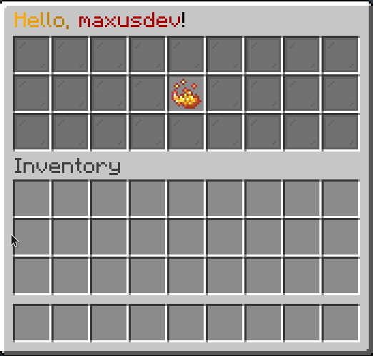

# UI Basics

In this page we will go over basic UI creation with Flare.
Check out the [Flare Basics](/basic) first if you haven't already!

## Composable

A `Composable` is an interface that represents an element that can be rendered
inside inventory in Flare. More on different composable types in the [UI Elements](ui/composable) section.

Initially composable elements don't store any data on where they should be rendered.
For that there is another interface (that you can implement): `ComposableSpace`, which shows
where a composable should be rendered. By default, Flare provides three implementations of 
composable spaces:

### Slot
A single slot stores row and column positions inside Inventory. There are also static 
utility fields that can help you get a specific slot:

```java
Slot.ROW_ONE_SLOT_TWO; // equal to new Slot(0, 1);
Slot.ROW_FIVE_SLOT_ONE; // equal to new Slot(4, 0);
Slot.ROW_THREE; // space containing all slots inside row one
Slot.ALL; // space containing all slots inside inventory
// Slot.COLUMN_N is currently planned
```

Rows are enumerated starting with 0 and going up to 5 for the row 6 of a six-by-nine inventory.
Columns are enumerated from left to right starting with 0 and going up to 8 for column 9.

### Rect
A Rect is a rectangle area containing all slots starting with Slot A, 
and ending with Slot B **inclusive**.

Here is an example:
```java
Rect.of(Slot.ROW_ONE_SLOT_ONE, Slot.ROW_THREE_SLOT_TWO); 
/* 
    will construct a rectangle between slots (0, 0) and (2, 1)
    when represented in inventory will look like this:
    $$#######
    $$####### -> @ are slots occupied by rect, # are the ones that are not
    $$####### (if the inventory dimensions are THREE_BY_NINE, more on that later)
*/
```

### SetSpace

A SetSpace defines a set of slots it occupies. The slots are static and immutable.
You should use SetSpace if you want to define non-conventional slot space, e.g. a diagonal
space.

```java
var space = new SetSpace(Set.of(
        Slot.ROW_ONE_SLOT_ONE,
        Slot.ROW_FIVE_SLOT_THREE,
        Slot.ROW_SIX_SLOT_FOUR,
        Slot.ROW_SIX_SLOT_FIVE
        ));
```

## Frames

In Flare, a single UI is represented by a `Frame`. There are different kinds of
frames, we will go over all of them.

What all frames ultimately do is store `Composable` elements inside them. Here's how to make a simple frame:

```java
public class DocFrame extends SimpleFrame {
    @Override
    public void init() {

    }
}
```

And then to open it to a player:

```java
Inventory inventory = Flare.open(new DocFrame(), player);
```

Here's what you get with this simple code:


As you can see, default UI size is 6 by 9, if you wish to change this, you can override the constructor:

```java
public class DocFrame extends SimpleFrame {
    public DocFrame() {
        super(Dimensions.THREE_BY_NINE);
    }

    @Override
    public void init() {

    }
}
```


### Composing UI

Now it's time to change our actual initialization logic. Let's change our UI title!

``` java
@Override
public String getTitle() {
    return "<gradient:gold:black>My Cool UI!"; // (1)
}
```

1. **All** strings in Flare support lenient MiniMessage for component styling. Read more about MiniMessage [here](https://docs.advntr.dev/minimessage/index.html) 

And here's what you get:


PlaceholderAPI is supported (if it is enabled and the plugin is present)!

```java
@Override
public String getTitle() {
    return "<gradient:gold:black>Hello, <dark_red>%player_name%</dark_red>!";
}
```


Alright, now that we have set up the frame, let's start actually adding content to it!

Let's add some background and a button!

```java
@Override
public void init() {
    this.compose(
        Placeholder
            .of(ItemProvider.still(Items.empty()))
            .inside(Slot.ALL)
    );
    this.compose(
        Button
            .builder(Items.builder(Material.BLAZE_POWDER)
                            .name("<gold>I am a button!")
                            .lore("<yellow>Click me!")
                            .hideAllFlags()
                            .glint())
            .onClickCancelling((btn, e) -> 
                e.getWhoClicked().sendMessage(FlareUtil.text("Hey, you <gold>clicked</gold> me!"))
            )
            .inside(Slot.ROW_TWO_SLOT_FIVE)
    );
}
```

This should create a simple Frame with a background and a button. Here's the result:



#### Some Reactivity

Let's add some reactivity to this UI! All frames have a utility hook called `useState`,
which allows us to define a reactive state faster. We can then use a `ReactiveItemProvider` to
re-render our button on state change:

```java
@Override
public void init() {
    // Replace the button composition with this:
    var clickCount = useState(0);
    this.compose(
            Button
                    .builder(Reactive.item(clickCount, newCount ->
                        Items.builder(Material.BLAZE_POWDER)
                                .name("<gold>I am a button!")
                                .lore("<yellow>You clicked me <green>%s</green> times!".formatted(newCount))
                                .hideAllFlags()
                                .glint()
                                .build()
                    ))
                    .onClickCancelling((btn, e) ->
                            clickCount.set(clickCount.get() + 1)
                    )
                    .build().bind(clickCount) // (1)
                    .inside(Slot.ROW_TWO_SLOT_FIVE)
    );
}
```

1. When we bind a ReactiveState to a Composable, the Composable is *marked dirty* and *re-rendered* on state change.

Here is the result:

